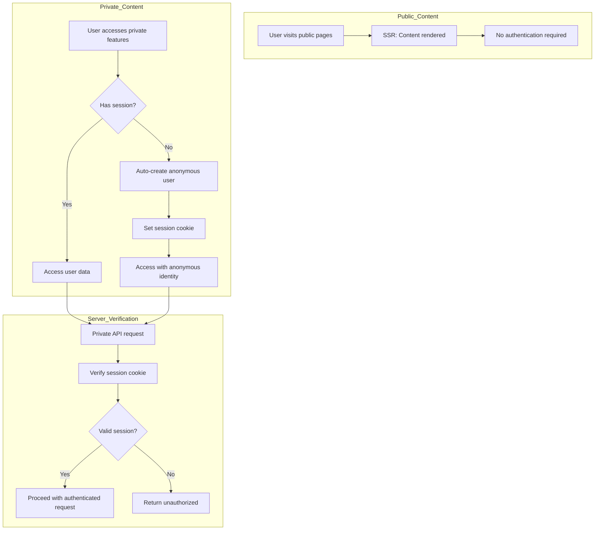
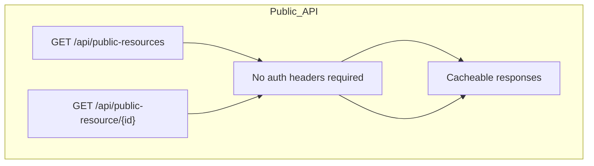
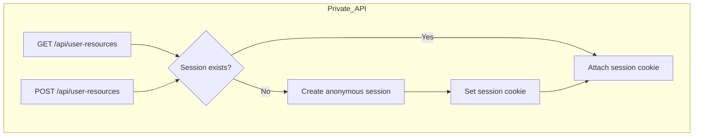
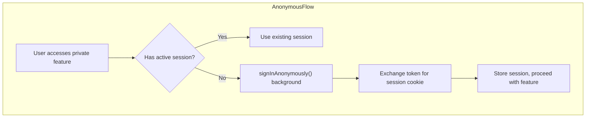
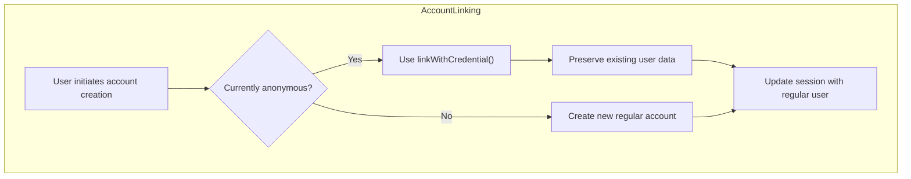
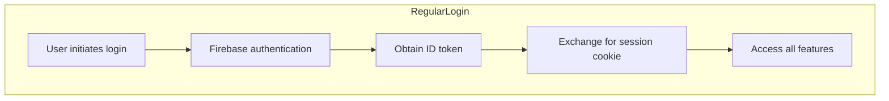
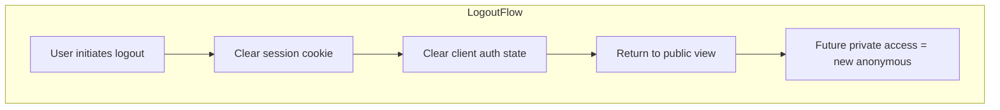

# General-Purpose Authentication Patterns with Firebase Auth

Target: Next.js 15 (App Router, RSC) + TypeScript 5
Stack: Firebase Auth, Zustand, TanStack Query, Session Cookies

This document outlines general-purpose authentication patterns for applications with public/private content split, anonymous user support, and progressive account enhancement. The patterns are designed for Firebase Auth but principles apply to other providers.

## Core Architecture Principles

### 1. Public-First Design
- **No auth barriers**: Core functionality accessible without authentication
- **SEO optimization**: Public content is server-rendered and cacheable
- **Progressive enhancement**: Authentication adds features without blocking basic access
- **Fast initial load**: No auth checks required for primary use cases

### 2. Anonymous User Support
- **Seamless onboarding**: Users can start using private features immediately
- **Background authentication**: Anonymous sign-in happens automatically when needed
- **Data preservation**: Anonymous → regular account linking maintains all user data
- **Reduced friction**: No registration required for initial engagement

### 3. Hybrid Rendering Strategy
- **Public content**: Server-Side Rendering (SSR) for performance and SEO
- **Private content**: Client-Side Rendering (CSR) after authentication
- **Smart hydration**: Minimal JavaScript for public pages, full interactivity for private areas

## Authentication Flow Overview



## Content Access Patterns

### Public Content Flow



**Characteristics:**
- No authentication headers required
- Optimized for caching and CDN distribution
- Server-side rendering with static generation where possible
- Minimal JavaScript for basic interactivity

### Private Content Flow



**Characteristics:**
- Requires authentication but creates anonymous users automatically
- Client-side rendering after authentication initialization
- Session management via httpOnly cookies
- Background anonymous sign-in for seamless UX

## Authentication State Management

### Anonymous User Creation



**Implementation Notes:**
- Automatic and transparent to user
- No UI interruption or loading states
- Session cookie set with httpOnly, Secure, SameSite=Lax
- Anonymous flag tracked for feature gating

### Account Linking (Anonymous → Regular)



**Key Benefits:**
- Same UID preserved during linking
- All anonymous user data remains accessible
- Seamless transition without data loss
- Feature unlock after successful linking

### Regular User Login



**Features:**
- Email/password and OAuth providers supported
- Session restoration across devices
- Full feature access including premium features
- Cross-device synchronization

### Logout Flow



## Feature Access Tiers

### Tier 1: Public Features (No Auth)
- Browse and read public content
- Search and filtering
- Basic social features (views, likes)
- Landing pages and marketing content

### Tier 2: Private Features (Anonymous OK)
- Personal data creation and storage
- Save/bookmark public content
- Basic personalization and preferences
- Private workspace functionality

### Tier 3: Account Features (Regular Users Only)
- Profile management and settings
- Content publishing and sharing
- Advanced features and integrations
- Cross-device synchronization
- Premium/paid features

## API Design Patterns

### Public API Design
```typescript
// No authentication required
GET /api/public-content
GET /api/public-content/{id}
GET /api/search?q={query}

// Response includes caching headers
Cache-Control: public, max-age=3600
```

### Private API Design
```typescript
// Session-based authentication
GET /api/user/content      // List user's private content
POST /api/user/content     // Create new private content
PUT /api/user/content/{id} // Update existing content
DELETE /api/user/content/{id} // Delete content

// Headers: Cookie: __session=<encrypted-session>
```

### Account-Only API Design
```typescript
// Requires regular (non-anonymous) user
GET /api/user/profile      // Get user profile
PUT /api/user/profile      // Update profile
POST /api/user/publish     // Publish content publicly
GET /api/user/analytics    // Access advanced features
```

## Session Management

### Cookie Configuration
```typescript
const sessionCookie = {
  httpOnly: true,
  secure: process.env.NODE_ENV === 'production',
  sameSite: 'lax' as const,
  maxAge: 14 * 24 * 60 * 60, // 14 days
  path: '/'
}
```

### Session Verification
```typescript
// Server-side session verification
async function verifySession(request: Request) {
  const sessionCookie = request.cookies['__session']
  if (!sessionCookie) return null
  
  try {
    const decodedClaims = await admin.auth().verifySessionCookie(sessionCookie)
    return {
      uid: decodedClaims.uid,
      email: decodedClaims.email,
      isAnonymous: decodedClaims.firebase?.sign_in_provider === 'anonymous'
    }
  } catch (error) {
    return null
  }
}
```

## Client State Management

### Auth Store (Zustand Example)
```typescript
interface AuthState {
  user: User | null
  isAnonymous: boolean
  authInitialized: boolean
  initializeAuth: () => Promise<void>
  signUp: (credentials: SignUpData) => Promise<void>
  signIn: (credentials: SignInData) => Promise<void>
  signOut: () => Promise<void>
}
```

### Progressive Enhancement
- Start with anonymous user for immediate functionality
- Prompt for account creation when accessing restricted features
- Show upgrade benefits without blocking current workflow
- Preserve all work when upgrading to regular account

## Security Considerations

### Content Security Policy
```http
Content-Security-Policy: 
  default-src 'self';
  script-src 'self' 'strict-dynamic' 'nonce-{generated}';
  connect-src 'self' https://*.firebaseapp.com https://identitytoolkit.googleapis.com;
  frame-src https://vercel.live;
```

### Data Privacy
- Anonymous user data is private by default
- Clear consent flow for any public data sharing
- Graceful account deletion with data cleanup
- GDPR-compliant data export and deletion

### Authentication Bridge Endpoints
```typescript
POST /api/auth/login    // Exchange Firebase token for session cookie
POST /api/auth/logout   // Clear session cookie
GET /api/auth/session   // Verify and return session info
```

## Implementation Checklist

### Public Content
- [ ] Public pages render without authentication
- [ ] Content is server-rendered for SEO
- [ ] Caching headers configured appropriately
- [ ] Search and filtering work without login

### Anonymous User Flow
- [ ] Private areas auto-create anonymous sessions
- [ ] User data persists across browser sessions
- [ ] No blocking authentication prompts
- [ ] All core features work for anonymous users

### Account Linking
- [ ] Anonymous users can create accounts seamlessly
- [ ] `linkWithCredential` preserves existing data
- [ ] Regular users can login and access their data
- [ ] Feature unlocking works correctly after linking

### Security Implementation
- [ ] Session cookies are httpOnly and secure
- [ ] Private API endpoints verify authentication
- [ ] CSRF protection implemented
- [ ] Rate limiting on authentication endpoints

## Technology Integration

### Firebase Auth Setup
```typescript
import { initializeApp } from 'firebase/app'
import { getAuth, connectAuthEmulator, signInAnonymously } from 'firebase/auth'

const app = initializeApp(firebaseConfig)
const auth = getAuth(app)

// Development emulator support
if (process.env.NODE_ENV === 'development') {
  connectAuthEmulator(auth, 'http://localhost:9099')
}
```

### Next.js App Router Integration
- Use Server Components for public content
- Use Client Components for authenticated features
- Implement route handlers for API endpoints
- Configure middleware for security headers only

This pattern provides a flexible foundation for applications requiring seamless user onboarding with progressive authentication enhancement.