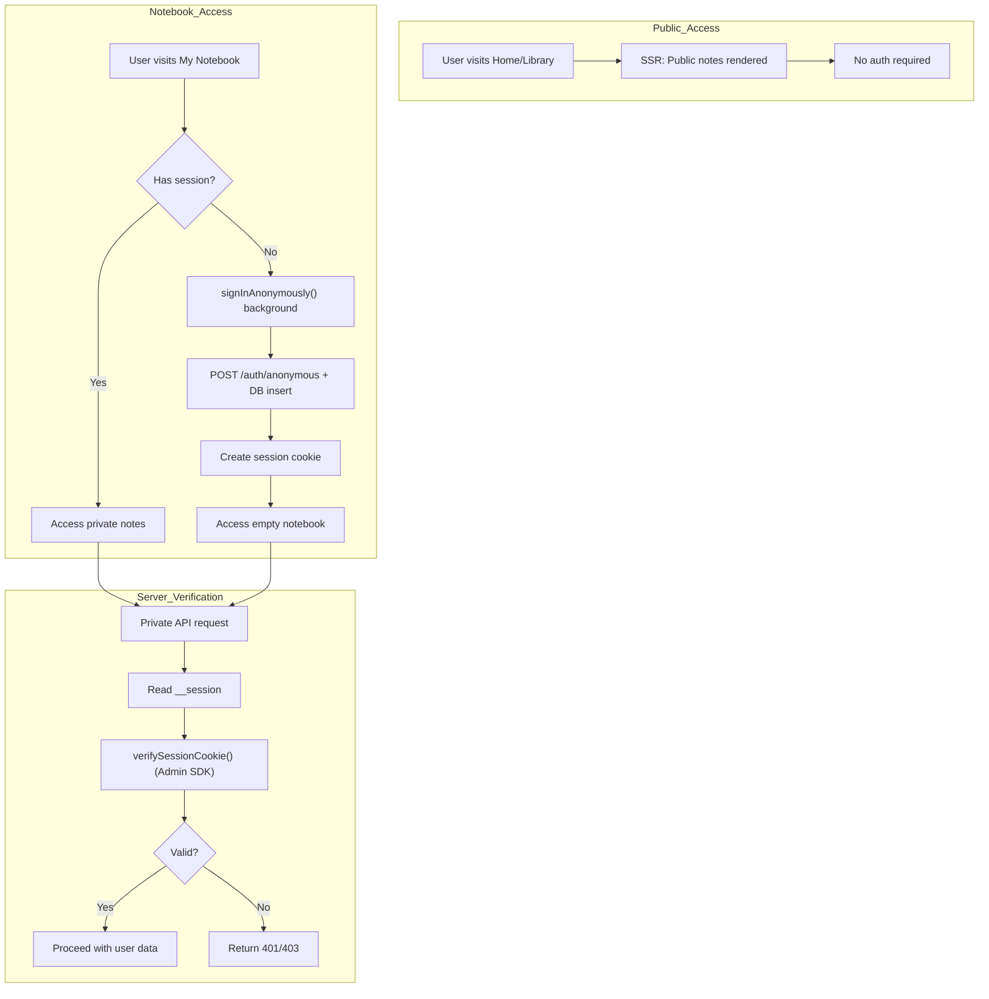
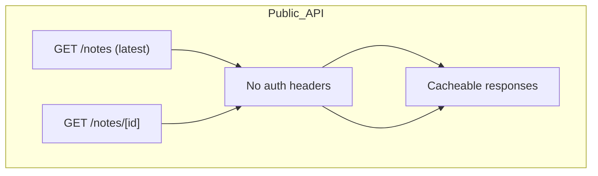
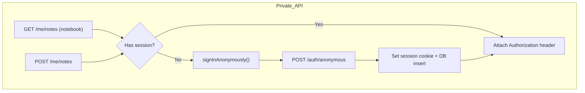
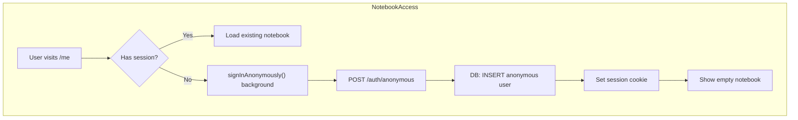
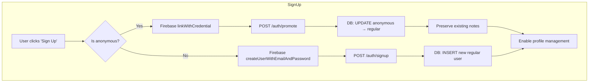
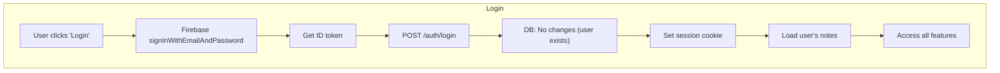
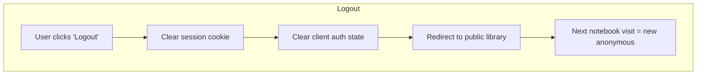

# Authentication Flow: Simple Note Application

Target: Next.js 15 (App Router, RSC) + TypeScript 5
Stack: Firebase Auth, Zustand, TanStack Query, Tailwind/shadcn, Vercel

This document specifies the authentication flow for a simple note-taking application. The system allows anonymous browsing of public notes, seamless anonymous user creation for personal plain text notebooks, and promotion to regular accounts for basic profile management while preserving all user data.

## Summary

| Flow Diagram                  | Purpose                                                                                 |
| ----------------------------- | --------------------------------------------------------------------------------------- |
| Overview                      | High-level control flow: public browsing, notebook access, server verification         |
| CSR / SSR & API Requests      | How tokens are handled for public vs private content                                    |
| Login / Logout / Promotion    | Anonymous notebook creation, regular login, seamless account linking                   |

## 1. Overview

### 1-1. Principles

- **Public-first**: Public latest notes page requires no authentication; optimized for SEO and fast access.
- **Anonymous notebook**: Accessing "My Notebook" automatically creates anonymous user session in background.
- **Seamless promotion**: Anonymous users can sign up/login while preserving all private notes via `linkWithCredential`.
- **Progressive enhancement**: Authentication enhances the experience but never blocks basic functionality.

### 1-2. Page Access Patterns

- **Public Pages** (`/`, `/notes/[id]`): Server-rendered, no auth required, cacheable.
- **Personal Notebook** (`/me`): Client-rendered, auto-creates anonymous session if none exists.
- **Account Profile** (`/account`): Client-rendered, requires regular (non-anonymous) user for basic profile management.

## 2. Public vs Private Content Access

### 2-1. Public Content (SSR)

- **Public notes API**: No authentication required, optimized for caching and SEO.
- **Server-side rendering**: Public pages are fully rendered on the server with static generation where possible.
- **Client hydration**: Minimal JavaScript for basic interactive features.

### 2-2. Private Content (CSR)

- **Personal notebook API**: Requires authentication; creates anonymous user automatically.
- **Client-side rendering**: Notebook pages are fully client-rendered after auth initialization.
- **Auto-anonymous**: First visit to `/me` triggers `signInAnonymously()` → `POST /auth/anonymous` flow.
- **Session management**: All private API calls use session cookies for server verification.
- **Database operations**: Anonymous users automatically stored in database during auth bridge.

## 3. Authentication Flows

### 3-1. Anonymous Notebook Access

- **Trigger**: First visit to "My Notebook" (`/me`) without existing session.
- **Background process**: Anonymous sign-in happens automatically, no user interaction required.
- **API bridge**: `POST /auth/anonymous` exchanges Firebase token for session cookie.
- **Database operation**: Anonymous user data is inserted into database if new user.
- **Session creation**: httpOnly session cookie established for subsequent API calls.
- **UX**: User sees empty notebook and can immediately start creating notes.

### 3-2. Account Creation (Sign Up)

- **Anonymous promotion**: Uses Firebase `linkWithCredential` + `POST /auth/promote` to update database.
- **New user signup**: Uses Firebase `createUserWithEmailAndPassword` + `POST /auth/signup` for database insertion.
- **Database operations**: Distinct endpoints handle UPDATE (promotion) vs INSERT (new signup).
- **Feature unlock**: Regular accounts gain access to basic profile management.
- **Data preservation**: Anonymous promotion preserves all private notes under same UID.

### 3-3. Account Login (Existing Users)

- **Existing users**: Direct login with email/password authentication.
- **API bridge**: `POST /auth/login` exchanges Firebase token for session cookie.
- **Database operation**: No database changes required (user already exists).
- **Session restoration**: Fresh session cookie established for API access.
- **Data access**: User regains access to all their private notes and profile features.

### 3-4. Account Logout

- **Complete logout**: Clears both server session and client auth state.
- **Public access**: User returns to public library view.
- **Future notebook access**: Next visit to `/me` creates fresh anonymous session.
- **Data isolation**: Previous notes remain tied to logged-out account.

## 4. Feature Access Patterns

### 4-1. Public Features (No Auth)
- **Browse latest notes**: Home page, note detail pages.
- **Read notes**: Full content access without any authentication.

### 4-2. Notebook Features (Anonymous OK)
- **Personal notes**: Create, edit, delete private plain text notes.
- **Manual save**: Save notes with explicit save action.

### 4-3. Account Features (Regular Users Only)
- **Profile management**: Basic display name and email management.

### 4-4. Progressive Enhancement
- **Upgrade prompts**: Anonymous users see upgrade suggestions for profile management.
- **Seamless transition**: Account creation preserves all existing private notes.
- **Feature discovery**: Anonymous users can use all note-taking features before creating an account.

## 5. Security & Content Policy

### 5-1. Content **Security** Policy
- **Public pages**: Optimized CSP for fast loading and SEO.
- **Notebook pages**: Enhanced CSP including Firebase Auth domains.
- **Content safety**: Basic sanitization for plain text content.

### 5-2. Data Privacy
- **Anonymous data**: Anonymous users' notes are private by default.
- **Account linking**: Seamless data migration preserves privacy.
- **Data isolation**: Private notes remain private to the user only.

## 6. API Endpoints

### 6-1. Public API (No Auth)
- `GET /notes` - List latest public notes with pagination
- `GET /notes/{id}` - Get public note detail

### 6-2. Private API (Session Required)
- `GET /me/notes` - List user's private notes
- `POST /me/notes` - Create new private note
- `PATCH /me/notes/{id}` - Update private note
- `DELETE /me/notes/{id}` - Delete private note

### 6-3. Account API (Regular Users Only)
- `GET /me` - Get user profile
- `PATCH /me` - Update user profile

### 6-4. Authentication Bridge
- `POST /auth/anonymous` - Anonymous user authentication (INSERT DB if new)
- `POST /auth/login` - Regular user login (no DB changes)
- `POST /auth/signup` - New regular user registration (INSERT DB)
- `POST /auth/promote` - Anonymous to regular promotion (UPDATE DB)
- `POST /auth/logout` - Clear session cookie
- `GET /auth/session` - Verify current session

## 7. Design Rationale

### 7-1. Public-First Architecture
- **SEO optimization**: Public content is server-rendered and cacheable.
- **Fast initial load**: No auth required for primary use case (reading latest notes).
- **Progressive enhancement**: Authentication adds value without blocking access.

### 7-2. Anonymous-Friendly Flow
- **Reduced friction**: Users can start using personal notebook immediately.
- **Data preservation**: Anonymous → regular account linking maintains all user data.
- **Natural progression**: Users upgrade when they want profile management.

### 7-3. Technology Alignment
- **Next.js App Router**: SSR for public, CSR for private content.
- **Firebase Auth**: Seamless anonymous account linking.
- **Session cookies**: Secure server-side verification without client token exposure.

## 8. Implementation Checklist

### 8-1. Public Content Flow
- ✅ Public latest notes page renders without authentication
- ✅ Note detail pages are server-rendered for SEO

### 8-2. Anonymous Notebook Flow
- ✅ `/me` auto-creates anonymous user on first visit
- ✅ Private plain text notes are created and stored immediately
- ✅ Manual save functionality works for anonymous users

### 8-3. Authentication Flows
- ✅ Anonymous authentication via `POST /auth/anonymous` with database insertion
- ✅ Regular user login via `POST /auth/login` with no database changes
- ✅ New user signup via `POST /auth/signup` with database insertion
- ✅ Anonymous promotion via `POST /auth/promote` with database update
- ✅ `linkWithCredential` preserves same UID during promotion
- ✅ Profile management features unlock after account creation
- ✅ Existing users can login and access their data

### 8-4. Security Implementation
- ✅ Session cookies are httpOnly and secure
- ✅ Private API endpoints verify authentication
- ✅ Public content has appropriate caching headers
- ✅ User-generated content is sanitized before publishing

## 9. Data Model & Relationships

### 9-1. Note Types
- **Public Notes**: `{id, title, content, author?, createdAt, updatedAt, isPublic=true}`
- **Private Notes**: `{id, userId, title, content, createdAt, updatedAt}`
- **User Profile**: `{userId, displayName, email?, isAnonymous}`

### 9-2. Data Flow
- **Anonymous → Regular**: Same UID preserved; `isAnonymous` flag changes to false
- **Account Deletion**: Private notes deleted completely

### 9-3. Session Persistence
- **Anonymous users**: Session lost if client storage cleared; creates new UID
- **Regular users**: Can re-login with credentials to restore same UID
- **Cross-device**: Regular users can access notes from any device after login